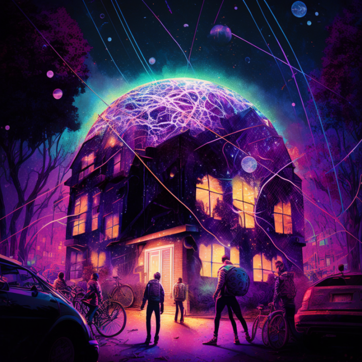

# randance
open a webapp to retrieve a quest to run to a nearby random spot within 1KM and gyrate your phone & body for 20 seconds. redeem: 1) gasless NFTs media artifacts, & 2)(maybe) gasless joy tokens 

forget headphones, but bring music



## theory
```
"One can of course see how each kind of society corresponds to a particular kind of machine 
- with simple mechanical machines corresponding to sovereign societies, thermodynamic machines 
to disciplinary societies, cybernetic machines and computers to control socieities.
But the machines don't exaplin anything, you have to analyse the collective apparatuses 
of which the machines are just one component."

"... It was clear that some kind of mysterious force condemned dynamic systems to death by exhaustion
(this is the meanin of the second principle of thermodynamics), bu the first principle
if thermodynamics states that the energy that "energy is conserver" and nothing is lost. 
It was therefore tempting to think that the energy that goes missing after each cycle was somehow 
'stolen; and that if a way could be found to recover it, the secret of perpetual motion would be found."

"... [Marx and Engels] imagined that someone - in this case the capitalist - was 'stealing' some of 
the missing energy, which if reintroduced into the cycle would allow the economy to perform at its best, 
this stolen energy being the 'surplus value' extracted off the backs of the proletarians."

"... The dissapation of the information over a thermodynamic cycle refers to the fact that 
the temperature differences even out over time, and the ability of energy to do work depends 
upon inequalities in temperature."

- Mark Alizart, Cryptocommunism
```

## tips
- playing next to a lake can be tricky

## development update
- need better geolocation hardware it seems
